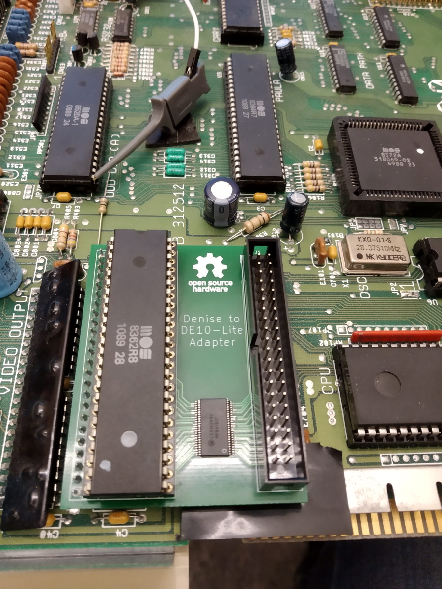
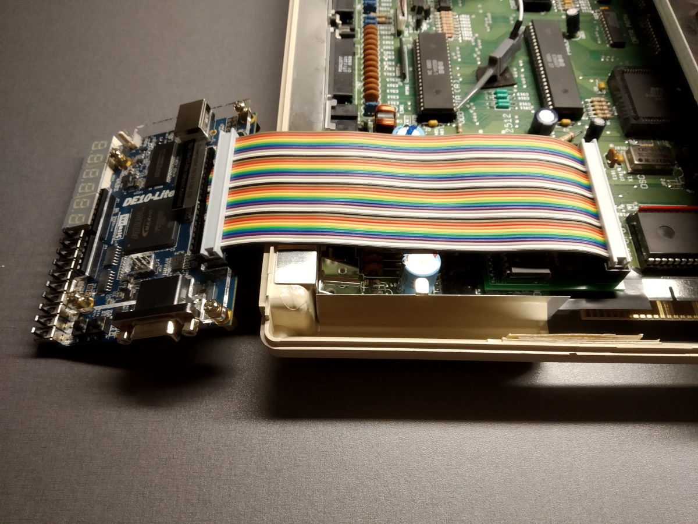
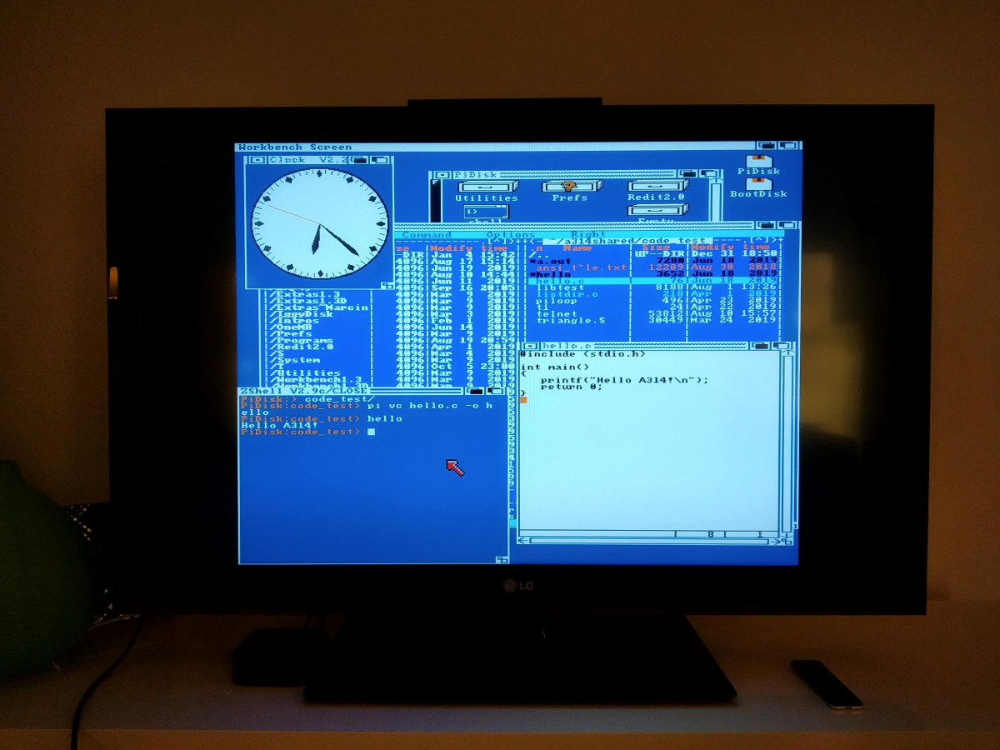

# flickerfixer
An open source flicker fixer for Amiga 500/2000

This is the first stage in the construction of a flicker fixer/scan doubler that mounts internally in an Amiga 500 or Amiga 2000.

In order to rapidly prototype the FPGA logic I designed a small adapter board that connects pins on Denise to a [DE10-Lite](http://de10-lite.terasic.com/) FPGA development board via a 5V-tolerant buffer. The KiCad files for the board are available in [Hardware](Hardware).

After ordering, receiving and soldering the PCB I then wrote Verilog code that samples CSYNC (composite sync) and the 12-bit RGB signals, and outputs the sampled pixels to VGA. The logic handles both non-interlaced and interlaced output from the Amiga. The Quartus project is available in [HDL](HDL).

The next stage is to design a stand-alone board that contains an [FPGA](https://www.mouser.se/ProductDetail/Intel-Altera/10M02SCE144C8G?qs=G%2FX6g08h60tD7HZOc4xZbg%3D%3D) chip and an [SDRAM](https://www.mouser.se/ProductDetail/ISSI/IS42S16400J-6TL?qs=sGAEpiMZZMti5BT4iPSEnRbV70NKySN8V%252BBluA5se8I%3D) chip.

Some pictures:

|         |            |
| ------------- |---------------|
|  |  |
| |  |
